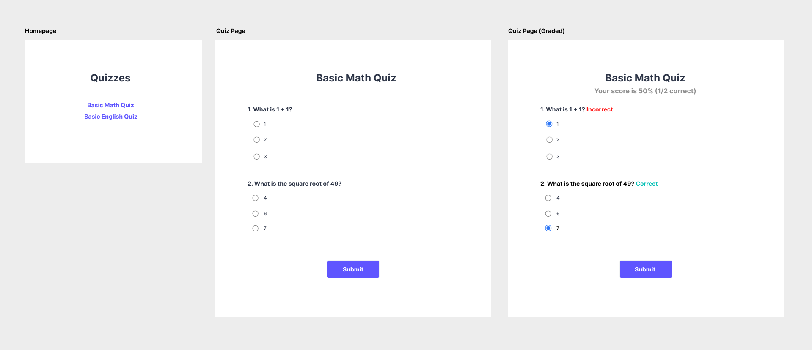

# 📝 Quiz App

Welcome! As the world's largest interview prep community and learning platform, we're always working to build better learning experiences for our users. This project is designed to give you a fun, hands-on example of what it would be like to develop products at Exponent.

## Assignment

In this takehome assignment, you'll be building a simple **Quiz app** that allows the user to take a multiple choice quiz, which will be graded automatically by our server for instant feedback.

The backend API that provides the quiz data and grading has been implemented for you already—but it's up to you to build the user-facing experience that integrates with this API. Don't worry about storing data or user authentication for now–that's out of scope for this project.

> Note: We've set up a simple React app and server using create-react-app and Express.js to make it easier to get started with building. Feel free to install any additional libraries you'd like to use. If you're not familiar with React, feel free to use a different framework!

## Goals
Here's the list of features we'd like our app to support:
* Homepage: User can view a list of available quizzes and click on them
* Quiz page: User can view a quiz and see multiple choice questions
* Grading: User can submit the quiz and see their grade 

## Design
Here's a mockup of the design that we'd like to implement:


## What you should submit

* A .zip file containing your updated source code or a private fork of the repository
* If necessary, please provide any additional notes to run or test the application

## Development

After downloading the repo, go to the directory and run 
```
npm install
```
and then run 
```
npm start
```
You can access the local server at [localhost:3000](http://localhost:3000). You can then create or modify files in the `src/` directory.

## API Documentation

### **GET `/api/quizzes/:id`**
Returns a Quiz data object given a valid quiz ID

**Request**

| Key | Type | Description
| -- | -- | -- |
| `id` | `String` | A unique identifier for the quiz


**Response**

| Key | Type | Description
| -- | -- | -- |
| `id` | `String` | A unique identifier for the quiz
| `title` | `String` | The human-readable title of the quiz
| `questions` | `Array<Question>` | An array of multiple choice questions


**`Question` Format**
| Key | Type | Description
| -- | -- | -- |
| `id` | `String` | An id for the question, unique to this quiz, e.g. "question_1"
| `text` | `String` | The text content of the question
| `options` | `Array<String>` | A list of multiple choice options

Example response:
```json
{
  "id": "example",
  "title": "My Quiz",
  "questions": [{
    "id": "question_1",
    "text": "What is 1 + 1?",
    "options": ["1", "2", "3"]
  }, {
    "id": "question_2",
    "text": "True or false: 2 + 2 = 4",
    "options": ["True", "False"]
  }]
}
```

### **POST `/api/quizzes/:id/attempt`**

Handles submitting a quiz attempt and returns a graded result showing which questions were correct and incorrect.

**Request**
| Key | Type | Description
| -- | -- | -- |
| `answers` | `{[id: String]: String}` | An object mapping ID of each question to the user-provided value

**Response**
| Key | Type | Description
| -- | -- | -- |
| `correct` | `Number` | Number of correct answers
| `incorrect` | `Number` | Number of incorrect answers
| `questions` | `{[id: String]: Boolean}` | An object mapping ID of each question to the graded result, where `true` represents a correct answer.

```json
// POST /api/quizzes/1/attempt
{
  "answers": {
    "question_1": "2",
    "question_2": "False"
  }
}

// Response
{
  "correct": 1,
  "incorrect": 1,
  "questions": {
    "question_1": true,
    "question_2": false,
  }
}
```

Note: The API may return a 404 if the quiz does not exist or a 400 if incorrectly formatted.

